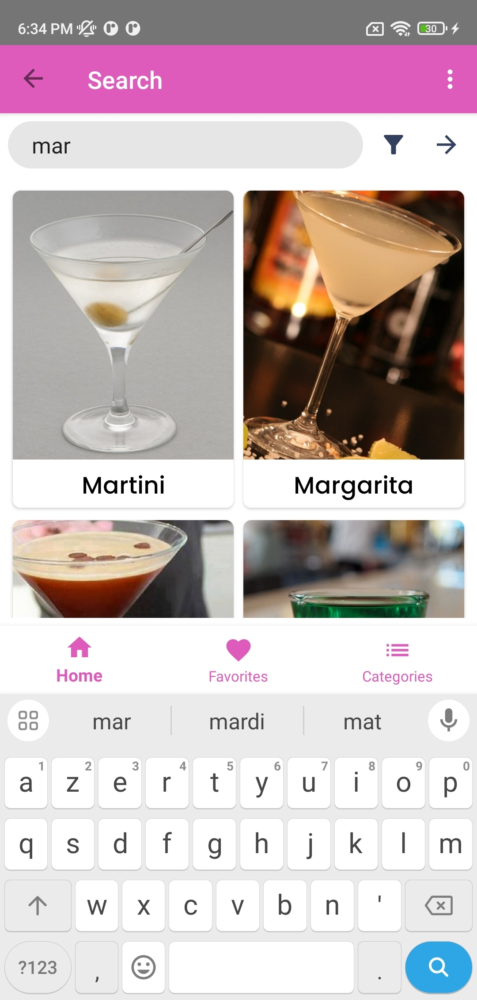

# Cocktail App Readme

* **Developed by:** Mohamed BAHLOUL and Rafik REKHIS

## Libraries and Technologies Used

- **Navigation Component:** One activity contains multiple fragments instead of creating multiple activities.
- **Retrofit:** Making HTTP connection with the REST API and converting cocktail JSON files to Kotlin/Java objects.
- **SharedPreferences:** Saving cocktails in the local database.
- **MVVM & LiveData:** Separating logic code from views and saving the state in case the screen configuration changes.
- **View Binding:** Instead of inflating views manually, view binding will take care of that.
- **Glide:** Caching images and loading them into ImageView.

## Features

In our application, we have three pages that can be accessed from the bottom navigation bar: Home, Favorites, and Categories.
There is also an options menu, accessed by the app bar, allowing navigation to five pages: Search, Settings, Ingredients, Glass, and Cocktail Type.

We have also added a loader while waiting for the data to be loaded from the API. For example, we have added a circular progress indicator in the Home page and a linear progress indicator in the Cocktail Details page.

- **Splash Screen:**
  Contains the application logo and name. It is displayed for 2 seconds before navigating to the Home page.

- **Home Page:**
  Contains a random cocktail suggestion, a list of the most recently viewed cocktails, and a list of cocktail categories.

Tapping on a cocktail image navigates to the Cocktail Details page where details can be viewed and the cocktail can be added to favorites.

- **Favorites Page:**
  Contains a list of favorite cocktails.

- **Categories Page:**
  Contains a list of cocktail categories.

Tapping on a category navigates to the Cocktails by Category page, where cocktails of the selected category and their total number can be viewed.

- **Ingredients Page, Glass Page, and Cocktail Type Page:**
  Similar to the Categories page, these pages contain lists of ingredients, glasses, and cocktail types, respectively.

Tapping on an item navigates to the corresponding Cocktails by Ingredient, Cocktails by Glass, and Cocktails by Cocktail Type pages, where cocktails of the selected item and their total number can be viewed.

- **Search Page:**
  Contains a search bar for searching cocktails by name. Writing the name in the search bar automatically shows cocktails containing the written name.

Filtering by category, ingredient, glass, and cocktail type is also possible.

- **Settings Page:**
  Contains a text view to change the number of cocktails in the last-seen list.

a switch button to enable/disable dark mode.

## Difficulties Encountered

We did not encounter blocking difficulties during the development of this application. However, the following features took the longest time to implement:
- Back, option menu (considering many scenarios to ensure smooth navigation).
- Search and favorites pages (implementing many improvements and tweaks for a positive user experience).
- Design (making numerous refinements for an attractive and user-friendly interface).